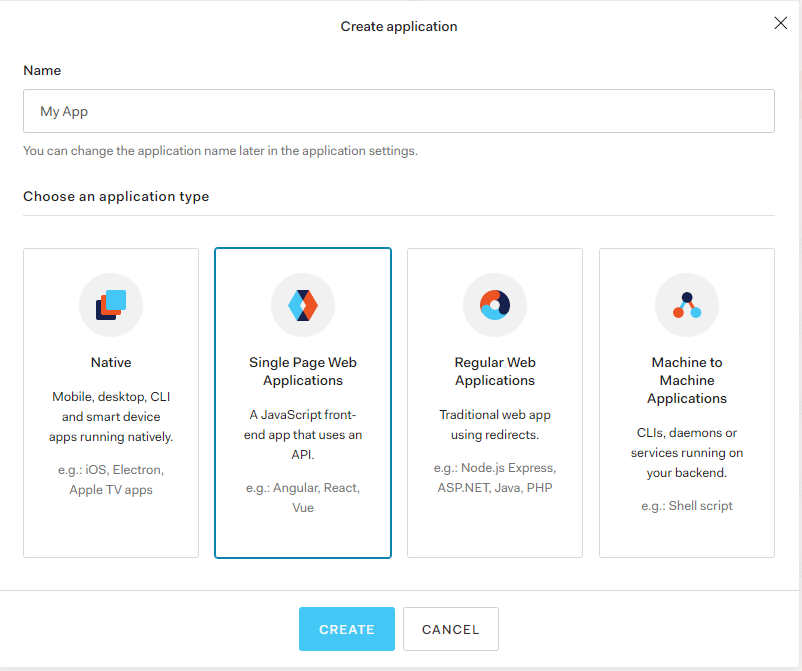
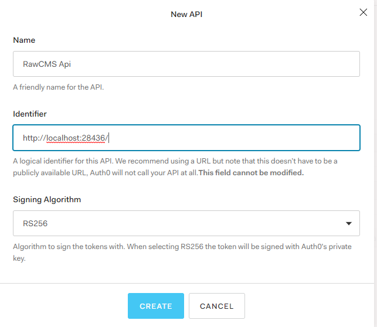

# Authentication

Authentication module allows to authenticate users in two ways:

- using RawCMS provider
- using external providers

RawCMS provider uses identity server four like internal IDP and exposes parts of its features.
The main target of RawCMS authentication is:

- identify a user and use user info to make different things (i.e., profile data and feature)
- use an external identity server to validate the user and get user info
- in case you do not have an identity server, RawCMS can act as an identity server

Please do not consider RawCMS as an identity server: we expose only minimal features to make the system autonomous.

## RawCMS Provider

Like all [configurable plugin](https://rawcms.readthedocs.io/en/latest/Configurable-Plugins/) of RawCMS, the authentication module can be configurable.

```json
{
  "plugin_name": "RawCMS.Plugins.Core.AuthPlugin",
  "data": {
    "RawCMSProvider": {
      "Authority": "http://localhost:50093",
      "ClientId": "raw.client",
      "ClientSecret": "raw.secret",
      "ApiResource": "rawcms"
    }
  }
}
```

RawCMSProvider property allows us to configure IdentityServer; in the next paragraph, we can see how we can get a token for the user.

## Users

When the user is stored locally, they saved into `_users` collection, with the following structure

```json
{
  "_id": ObjectId("5bb7d9dae0fb5006ec9fe4cc"),
  "Id": null,
  "UserName": "bob",
  "NormalizedUserName": "BOB",
  "Email": "test@test.it",
  "NormalizedEmail": "test@test.it",
  "PasswordHash": "WFla",
  "Roles": ["Admin", "Writer", "Reader"],
  "Metadata": {},
  "Claims": [],
  "_createdon": "2018-10-05T23:38:34.5793965+02:00",
  "_modifiedon": "2018-10-05T23:38:34.5819543+02:00"
}
```

Metadata is a custom part where you can add custom user info.

## Tests in standalone mode

### 0. Understand a little what to call

try to hit `http://{host}/.well-known/openid-configuration` to get info about available endpoints

### 1. Get the token

POST `http://{host}/connect/token`

**Headers**

```
Content-Type:application/x-www-form-urlencoded
```

**Body**

```
grant_type:password
client_id:raw.client
client_secret:raw.secred
scope:openid
username:bob
password:XYZ
```

**Result**

```json
{
  "access_token": "....",
  "expires_in": 3600,
  "token_type": "Bearer"
}
```

### 2. check for introspection

POST `http://{host}/connect/introspect`

**Headers**

```
Authorization:Basic <xxx>
Content-Type:application/x-www-form-urlencoded
```

where \<xxx\> is the standard basic authentication using username=api resource name, password=client secret. To compute it manually, just make base64 of string "apireousource:clientsecret", in case of default values (apiresource=rawcms, clientsecret=raw.secret) is:
`cmF3Y21zOnJhdy5zZWNyZXQ=`

**Body**

```
grant_type:password
client_id:raw.client
client_secret:raw.secret
scope:openid
username:bob
password:XYZ
```

**Result**

```json
{
  "access_token": "....",
  "expires_in": 3600,
  "token_type": "Bearer"
}
```

### 2. check for identity

POST `http://{host}/api/lambda/UserInfo`

**Headers**

```
Authorization:Bearer <sdfghjk>
```

**Response**

```json
{
  "IsAuthenticated": true,
  "nbf": "1541079731",
  "exp": "1541083331",
  "iss": "http://{host}",
  "aud": "rawcms",
  "client_id": "raw.client",
  "sub": "5bb7d830cc85173af89621d5",
  "auth_time": "1541079731",
  "idp": "local",
  "scope": "openid",
  "amr": "pwd"
}
```

## External Providers

Like we have to see Authentication plugin is configurable. On configuration JSON you can add multiple
external provider for authenticating users.
For configure external providers use _ExsternalProviders_ property.

```json
{
  "plugin_name": "RawCMS.Plugins.Core.AuthPlugin",
  "data": {
    "RawCMSProvider": {
      "Authority": "http://localhost:50093",
      "ClientId": "raw.client",
      "ClientSecret": "raw.secret",
      "ApiResource": "rawcms"
    },
    "ExternalProviders": [
      {
        "Mode": "JWT",
        "SchemaName": "Auth0",
        "Authority": "https://dev-t61kk2b.eu.auth0.com",
        "Audience": "http://localhost:28436/",
        "UserInfoEndpoint": "https://dev-t61kk2b.eu.auth0.com/userinfo",
        "RoleClaimType": "permissions"
      }
    ]
  }
}
```

### Configuration property

- **Mode**: identify the protocol used for retrieve token from an external provider(now set fixed JWT, on next release we'll add new supported protocols)
- **SchemaName**: unique identifier of schema
- **Authority**: external authority
- **Audience**: allowed audience
- **UserInfoEndpoint**: endpoint of external provider for retrieve user profile info
- **RoleClaimType**: name of claim to use like role claim

### Users

When you use an external provider, users have added automatically (at first login) on \_user collection. In this case, you can manage the Roles of the user both internal that external.
External Roles are managed using RoleClaimType property and on the login process are added on context all roles added on \_user collection property.

```json
{
  "_id": {
    "$oid": "5e5df5bcae10c15718f8a3d9"
  },
  "UserName": "admin@test.com",
  "Email": "admin@test.com",
  "IsExternal": true,
  "Roles": ["Reader"],
  "_createdon": "2020-03-03T07:14:03.1276147+01:00",
  "_modifiedon": "2020-03-03T07:14:03.1276252+01:00",
  "NormalizedUserName": "ADMIN@TEST.COM",
  "NormalizedEmail": "ADMIN@TEST.COM"
}
```

## AUTH0 like provider

In this chapter, we can see how to configure [Auth0](https://auth0.com/) like identity provider for single page application and integrate it with RawCMS.

- Create new application



- Configure application
  - set _Application type_ with Single Page Application
  - set _Allowed Callback URLs_ with SPA URL (http://localhost:8080/)
- Get parameters

  - ClientId
  - On advanced settings
    - OAuth Authorization URL
    - OAuth User Info URL

- Create new API
  
- Manage [role for users](https://auth0.com/docs/microsites/manage-users/manage-users-and-user-profiles)
- Configure Authentication plugin and run RAWCms
- Get token using OpenId protocol

```
GET https://dev-t61kk2b.eu.auth0.com/authorize?client_id=wPCzMpFJRdjUmWCA2ssS4zrs23nnwBtb&response_type=token&redirect_uri=https://localhost:8080/&audience=http://localhost:28436/&scope=openid profile email
```

- Use JWT token for call RAWCms API
